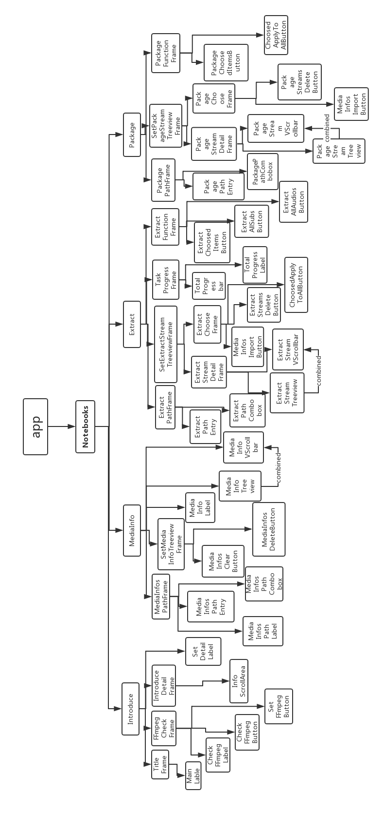
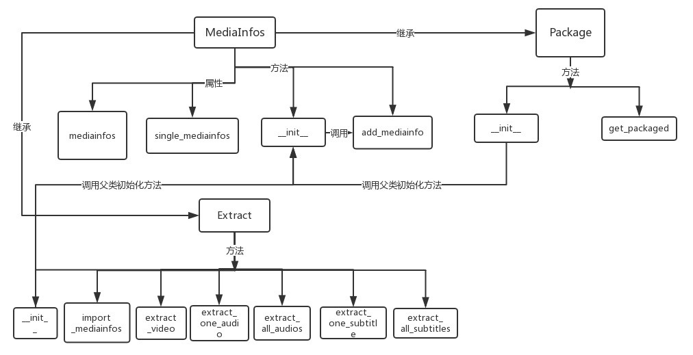
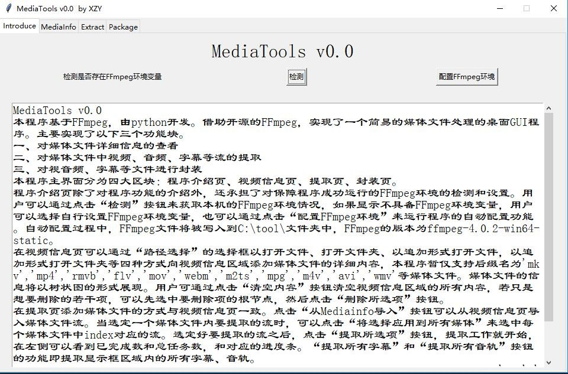
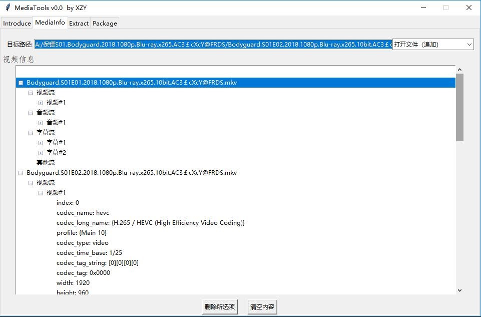
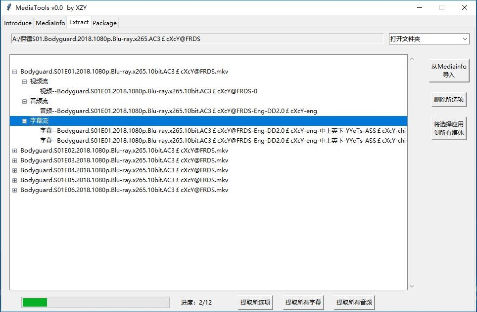
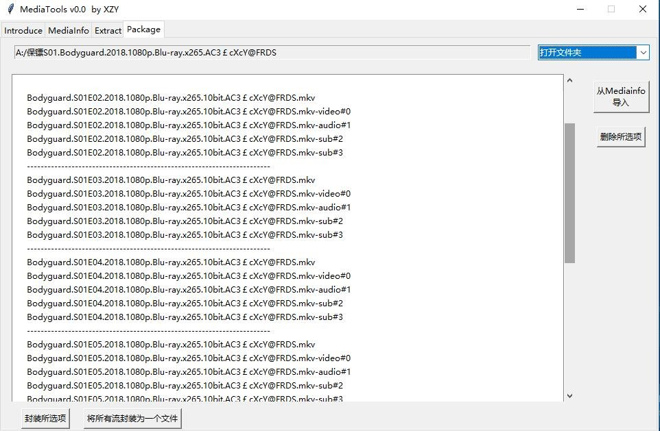

# FFmpegGui

>                                                                            一个调用FFmpeg命令的简单GUI程序

### 课题背景
在日常生活中，我们经常会接触到媒体文件，随之应运而生的便是对这些媒体文件的处理的需求。例如：查看视频的分辨率、码率、编码方式，了解音频的声道数；从视频中
提取音频、字幕；为视频添加音频、字幕等。而提到对媒体文件的处理，就不得不提及FFmpeg。FFmpeg既是一款开源的音视频编解码工具，同时也是一组音视频编解码开发
套件，作为编解码开发套件，它为开发者提供了丰富的音视频处理的调用接口。FFmpeg提供了多种媒体格式的封装和解封装，包括多种音视频编码、多种协议的流媒体、多种
色彩格式转换、多种采样率转换、多种码率转换等；FFmpeg框架提供了多种丰富的插件模块，包含封装与解封装的插件、编码与解码的插件等。综上所述，无疑FFmpeg是一
个极其强大的媒体文件的处理工具，然而让我们感到遗憾的是FFmpeg的使用是基于命令行的，同时它强大的功能同时带来了极其复杂的参数设置，这些就给我们的日常使用带
来了诸多不便。由此笔者萌生了打造一个基于FFmpeg的桌面GUI程序的念头，而开源软件基础课上所教授的python技术正给与了笔者实现以上功能的技术基础。

### 所用技术
>Python是一种广泛使用的高级编程语言，属于通用型编程语言，由吉多·范罗苏姆创造，第一版发布于1991年。可以视之为一种改良（加入一些其他编程语言的优点，如面向对象）的LISP。与Scheme、Ruby、Perl、Tcl等动态类型编程语言一样，Python拥有动态类型系统和垃圾回收功能，能够自动管理内存使用，并且支持多种编程范式，包括面向对象、命令式、函数式和过程式编程。其本身拥有一个巨大而广泛的标准库。作为一种解释型语言，Python的设计哲学强调代码的可读性和简洁的语法（尤其是使用空格缩进划分代码块，而非使用大括号或者关键词）。相比于C++或Java，Python让开发者能够用更少的代码表达想法。不管是小型还是大型程序，该语言都试图让程序的结构清晰明了。

>Python本身包含的Tkinter库能够支持简单的GUI开发。使用它们开发的桌面软件运行速度快，与用户的桌面环境相契合。通过PyInstaller还能将程序发布为独立的安装程序包。

>                                                                                              --摘自维基百科
由上可见，Python语言优美而又富有效率，同时它内置的库Tkinter即可满足笔者简单的GUI开发的要求，因此本程序使用Python开发，版本为Python 3.6.2。在本程序中，Python代码所承担的功能为搭建GUI画布，调用FFmpeg命令，整合数据，实现批量化等基础功能，核心功能由FFmpeg语句实现。

### 系统分析
本程序基于FFmpeg，由python开发。借助开源的FFmpeg，实现了一个简易的媒体文件处理的桌面GUI程序。

主要实现了以下三个功能块。
1. 对媒体文件详细信息的查看。
2. 对媒体文件中视频、音频、字幕等流的提取。
3. 对视音频、字幕等文件进行封装。

本程序主界面分为四大区块：程序介绍页、视频信息页、提取页、封装页。

程序介绍页除了对程序功能的介绍外，还承担了对保障程序成功运行的FFmpeg环境的检测和设置。用户可以通过点击“检测”按钮来获取本机的FFmpeg环境情况，如果显示不具备FFmpeg环境变量，用户可以选择自行设置FFmpeg环境变量，也可以通过点击“配置FFmpeg环境”来运行程序的自动配置功能。自动配置过程中，FFmpeg文件将被写入到C:\tool\文件夹中，FFmpeg的版本为ffmpeg-4.0.2-win64-static。

在视频信息页可以通过“路径选择”的选择框以打开文件、打开文件夹、以追加形式打开文件，以追加形式打开文件夹等四种方式向视频信息区域添加媒体文件的详细内容，本程序暂仅支持后缀名为`'mkv'，'mp4'，'rmvb','flv','mov','webm','m2ts','mpg','m4v','avi','wmv'`等媒体文件。媒体文件的信息将以树状图的形式展现。用户可通过点击“清空内容”按钮清空视频信息区域的所有内容，若只是想要删除的若干项，可以先选中要删除项的根节点，然后点击“删除所选项”按钮。

在提取页添加媒体文件的方式与视频信息页一致。点击“从Mediainfo导入”按钮可以从视频信息页导入媒体文件流。当选定一个媒体文件内要提取的流时，可以点击“将选择应用到所有媒体”来选中每个媒体文件中index对应的流。选定好要提取的流之后，点击“提取所选项”按钮，提取工作就开始，在左侧可以看到已完成数和总任务数，和对应的进度条。“提取所有字幕”和“提取所有音轨”按钮的功能即提取显示框区域内的所有字幕、音轨。封装页的功能为将视频流、音轨、字幕等文件打包成一个媒体文件。字幕文件支持的后缀名为`'sup','ssa','ass','srt','vtt','pgs'`，音轨文件支持的后缀名为`'aac','ogg','ac3','dts','mp3','flac','opus'`。

由于时间仓促，本次程序开发只覆盖了FFmpeg众多强大功能中的很小的一部分，后期将逐步更新更多功能。

### 系统设计
1. GUI模块结构图 
1. 功能模块图
    1. FFmpeg功能结构图
    
    
    1. Track功能结构图 

### 页面展示
1. 介绍页（功能介绍及环境配置）

1. 视频信息页（以树状结构展示的媒体信息）

1. 提取页

1. 封装页

### 感想
历时一个多月了，由于自己能力上的不足，这份大作业的完成度并不让人满意，希望之后能一步步完善。虽然有诸多不足，但是这次大作业的经历还是使我受益匪浅，它让我更加深刻的体会到了python语言的优美简练，让我认识到我能够用python较为轻易的实现自己平时所需要的一些功能，提高效率。通过这次大作业，在阅读了python的GUI官方文档后，我相对全面的了解了python的tkinter库，为今后的学习奠定了基础。更主要的是锻炼了自己对相对大规模的代码量的掌控度，在代码的coding过程中确实写了不少重复、垃圾代码，它也让我去思考代码更合理的结构、函数之间的调用关系、类的封装、线程的阻塞等等问题。这次大作业教会了我自我学习的重要性。
